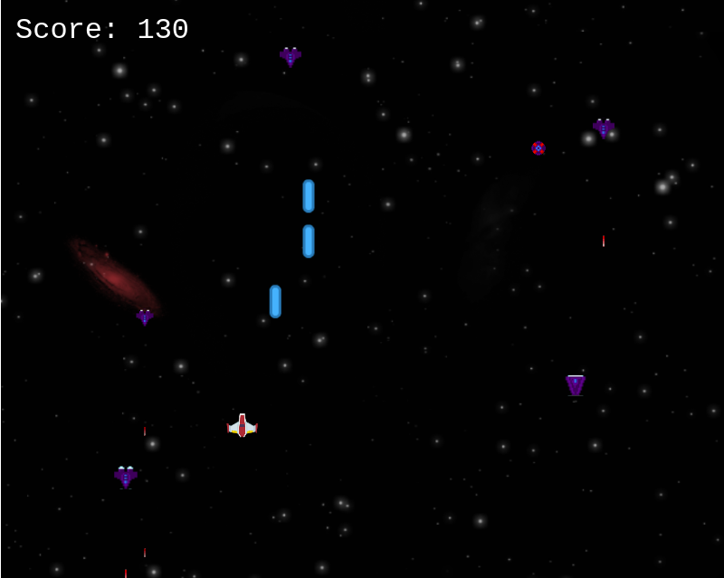
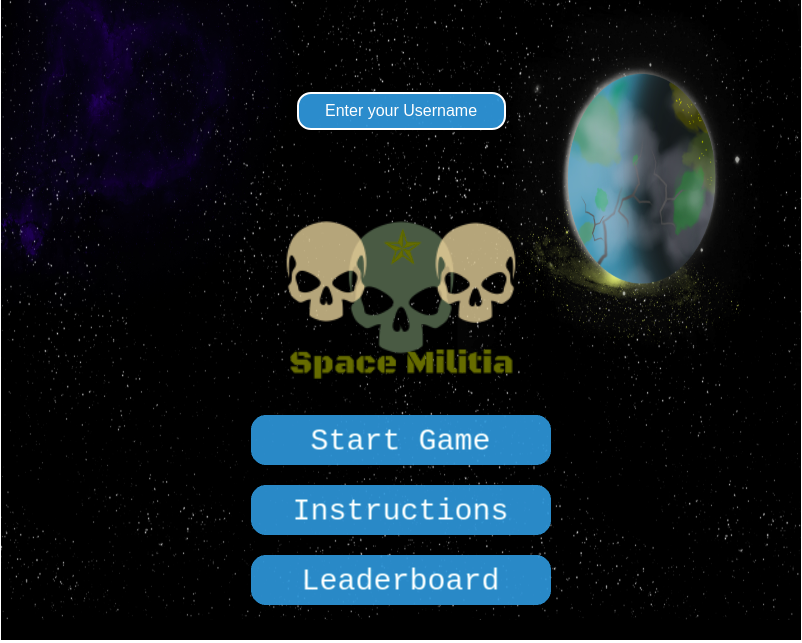

# Debugger Game

**Author: Paul Morah**

# Table of contents

- [Overview](#Overview)
- [Third party applications](#Third-party-applications)
- [Gameplay](#Gameplay)
- [Main Menu](#Main-Menu)
- [Scenes](#Scenes)
- [Game Characters](#Game-Characters)
  - [Player](#Player)
  - [Enemy](#Aliens)
- [Health](#Health)
- [Scoring](#Scoring)

## Overview

You have been given a task to stop Alien ships from invading Earth. Destroy as many alien ship as possible. You have unlimted amount lasers. 

## Third party applications

- Phaser 3 framework
- JavaScript ES6
- HTML5 / CSS3
- Webpack
- Babel
- storing scores APi

## Gameplay

- Use your keyboard to move and shoot down aliens
- W -> up
- A -> right
- S -> down
- D -> left
- SPACE BAR -> shoot

## Main Menu

The first thing you will see is a loading screen with a progress bar. This will load all necessary files and assets for the game. Then you will see the main menu scene with 3 buttons that lead you to other 3 different scenes

 

## Scenes

- **Game Scene**: Here is where the game take place.
- **Instructions**: Here you can read the game instructions on how to play
- **Leaderboard**: Here you can see the top player with their names and scores

## Game Characters
### Player

  

  The player is a space ship that aims and shoots after you press the space bar

### Aliens

  
  
  

  There are three enemies ship in the game. the chaser ship, the carrier ship, gun ship.

## Health 

**Player:** When an enemy laser or enemy ship touches the player the game is over

**AlienShip:** Once the player laser touches enemy ship, the aliens dies

## Scoring
  Each enemy ship a player shoots down. the player gets a ten point