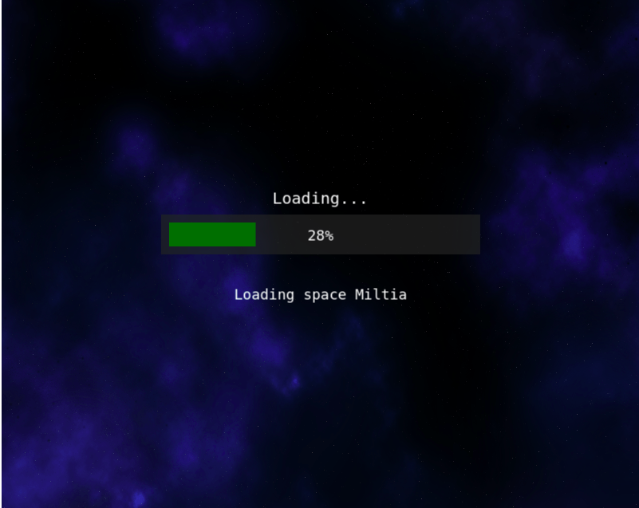
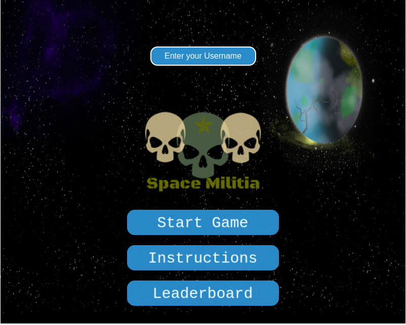
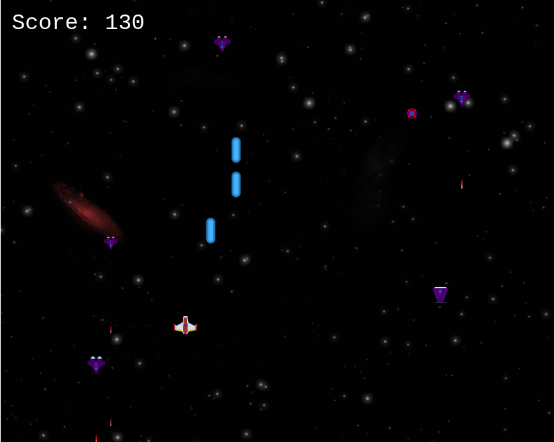

# Space-Militia
> This is a shooter game. Alien space ship are trying to invade your planet 
> you need to stop them using your keyboard W,A,S,D for movement and spacebar to shoot

## Built With

- Javascript ES6
- Phaser 3
- WebPack
- Scores APIs
- HTML / CSS
- VS Code

## How to Play

When you first open the game, you will see a loading screen. Once it finishes loading all the assets, it will show you the main menu of the game.

 

 

To Play you will need a keyboard and good reflexes. You first need to enter your name in the field on top. Then click on the "Start Game" button, the game will begin immediately, be ready!



Once the game has begun,

- You need to shoot down as many alien ships 
- your score increases when you shoot down an enemy spaceship
- If a an alien ship crashes into yours or you get shot down by alien ships, the game would be over.

## Live Demo

> To play this game online go [here](https://rawcdn.githack.com/chinweokwu/Space-Militia/ed9a9ebfba34f835d9ff685a8998a0e0e33b874a/dist/index.html)

## Game Design Document

> To check the GDD go [here](https://github.com/chinweokwu/Space-Militia/blob/branch-a/GameDesignDocument.md)

## How to Install

> If you want to have this game on your local machine just follow these simple steps

### Pre-requisites

To set up this project locally we will need:
- A bash terminal
- Node Package Manager (npm) installed in our system

### Setup

- Install npm in your system. Read the [Documentation](https://nodejs.org/en/download/package-manager/)
- Open your bash terminal and download this repo using this commad:
    ``` 
   git clone git@github.com:chinweokwu/Space-Militia.git
    ``` 
- On your terminal, go into the Space Militia folder with:
    ``` 
   cd Space-Militia
    ``` 
- Now run this commad to install all the dependencies:
    ``` 
   npm install
    ``` 
- Once it finishes downloading, run a local server using:
    ``` 
   npm start
    ``` 
- The setup is all done. You can now go to your [Local Server](http://localhost:3000/) and play

## Author  

👤 **Paul chinweokwu Morah**
- Github: [@paulmorah](https://github.com/chinweokwu)
- Twitter: [@Morah89820846](https://twitter.com/Morah89820846)
- Linkedin: [Paul Chinweoku Morah](https://www.linkedin.com/in/morah-paul/)

## Acknowledgment

This game is inspire by the [codeperfectionist](http://codeperfectionist.com/articles/phaser-js-tutorial-building-a-polished-space-shooter-game-part-3/)

All the assets for this game come from [OpenGameArt](https://opengameart.org/)


## 🤝 Contributing

Contributions, issues and feature requests are welcome!. Feel free to check the [issues page](https://github.com/chinweokwu/Space-Militia/issues).

## Show your support

Give a ⭐️ if you like this project!

## 📝 License
This project is [MIT](https://github.com/chinweokwu/Space-Militia/blob/develop/LICENSE) licensed.